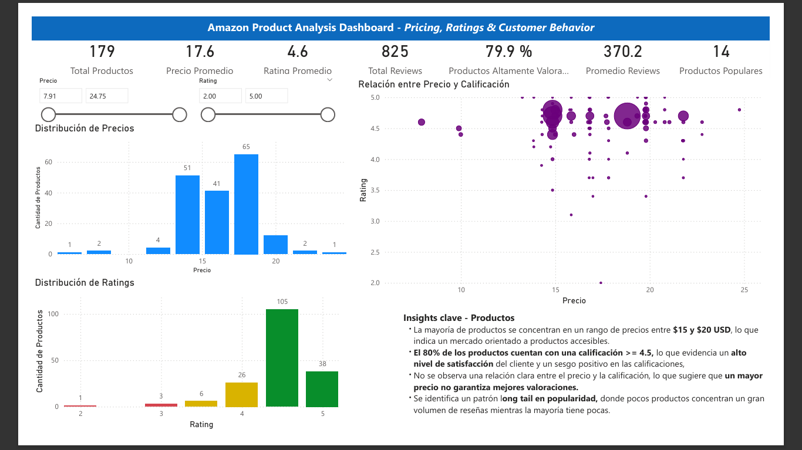
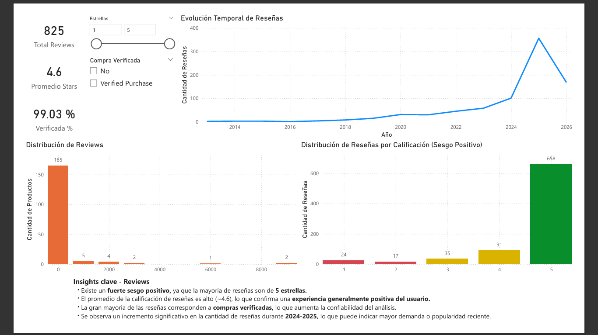

# 🛍️ Amazon Product Analysis

End-to-end data analysis project focused on Amazon product listings and customer reviews.  
This project covers the full data pipeline: web scraping, data cleaning, exploratory data analysis (EDA), and interactive dashboard creation using Power BI.

---

## 📌 Project Overview

The goal of this project is to analyze product pricing, customer ratings, and review behavior to extract actionable insights and identify patterns in customer satisfaction and product popularity.

---

## ⚙️ Tech Stack

- Python (Pandas, Requests, BeautifulSoup)
- Jupyter Notebook
- Power BI
- Excel
- Git & GitHub

---

## 📂 Project Structure 
```
amazon-product-analysis/
│
├── data/
│ ├── raw/
│ │ └── AmazonData.xlsx
│ ├── processed/
│ └── AmazonData_clean.xlsx
│
├── notebooks/
│ ├── 01_data_cleaning.ipynb
│ └── 02_eda.ipynb
│
├── src/
│ └── scraper.py
│
├── dashboard/
│ ├── amazon_dashboard.pbix
│ ├── dashboard_products.png
│ └── dashboard_reviews.png
│
├── reports/
│ └── eda_report.pdf
│
├── .gitignore
├── README.md
└── requirements.txt
```

---

## 🔍 Key Insights

- Over 80% of products have ratings ≥ 4.5, indicating a strong positive rating bias across the platform.

- Most products are priced between $15–$20 USD, suggesting a highly competitive pricing cluster where many sellers converge.

- Review distribution follows a long-tail pattern:
  - A small number of products accumulate a very high volume of reviews
  - The majority of products have relatively low review counts

- Verified purchases represent ~99% of reviews, increasing the reliability and credibility of the dataset.

- There is no strong correlation between price and rating, indicating that lower-priced products can achieve high customer satisfaction levels.

---

## 📊 Dashboard Preview

### Products Analysis


### Reviews Analysis


Interactive dashboard build in Power BI to explore pricing, ratings and customer behavior.

---

## 📈 Dashboard Features
- Price distribution analysis
- Rating distribution visualization
- Price vs Rating scatter plot
- Review volume distribution
- Review trends over time
- Verified purchase percentage
- Interactive filters (Price, Rating, Stars, Verified Purchase)

---

## 📈 Key Conclusions & Business Implications

- The strong positive rating bias (80% ≥ 4.5) suggests that ratings alone may not be sufficient to differentiate product quality, requiring additional metrics such as review volume or sentiment analysis.

- The concentration of products within the $15–$20 price range indicates a highly competitive market segment, where differentiation through branding, reviews, or product features becomes critical.

- The long-tail distribution of reviews highlights the importance of visibility and customer engagement, as a small number of products dominate in terms of review volume and perceived credibility.

- The lack of correlation between price and rating suggests that competitive pricing does not guarantee higher customer satisfaction, allowing lower-priced products to compete effectively on quality.

- The high percentage of verified purchases (~99%) increases confidence in the data and supports the reliability of insights derived from customer reviews.

- Overall, the analysis indicates that successful product positioning in e-commerce depends more on visibility, customer engagement, and differentiation rather than price alone.

---

## ⚠️ Limitations
- Dataset size is limited
- Web scraping may be affected by captchas or page restrictions
- Currency conversion uses a fixed exchange rate assumption
- Not all products have the same number of reviews

---

## 📌 Future Improvements

- Add sentiment analysis on reviews
- Automate data pipeline (ETL)
- Deploy dashboard online (Power BI Service)
- Expand dataset for more robust insights

---

## 🚀 How to Run the Project

1. Clone the repository:
git clone https://github.com/Amontesdeoca0/amazon-product-analysis.git

2. Install dependencies(optional):
pip install -r requirements.txt

3. Run scraper:
python src/scraper.py

4. Open notebooks for analysis:
- `01_data_cleaning.ipynb`
- `02_eda.ipynb`

5. Open Power BI dashboard:
- `dashboard/amazon_dashboard.pbix`

---

## 👤 Author

Adolfo José Montes de Oca López  
Data Analyst Project Portfolio

---

⭐ Notes
This project demonstrates an end-to-end data analysis workflow, combining data engineering, analysis, and visualization skills.
